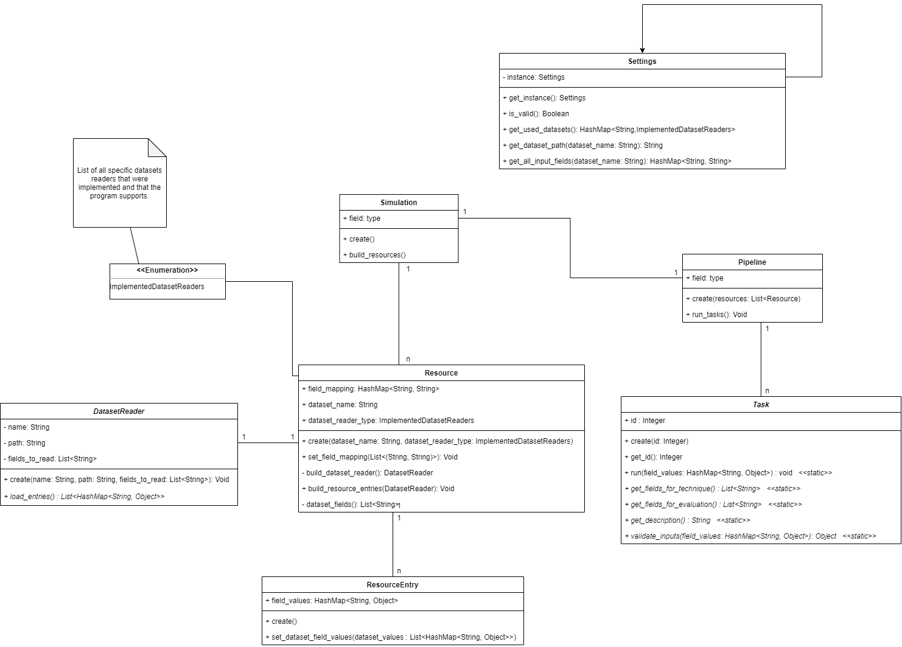

## System overview

UML class diagram

  
  

### Detailed execution steps

Prepare the resources that will be used by the tasks

The resources used by every task in the pipeline is loaded according to the following steps:

* In `Simulation.build_resources()`
    * Use `Settings.get_used_datasets()` to get the name and type of all used datasets.
    * Create a `Resource` instance for each configured dataset name.
    
* Each `Resource` receives, through dependency injection, the corresponding `DatasetReader`.

* The `Resource` instance uses the `DatasetReader` to read all groups of information from the 
  dataset (usually a line from the dataset corresponds to a single group of information).
* Each group of information is used to create an instance of `ResourceEntry`.

**Notes**

All `ResourceEntry` instances are managed by a single instance of `Resource`. 
Class `Resource` manages the mapping of fields and instructs the `DatasetReader` which specific 
fields should be read from the dataset.

Running tasks in the pipeline

* For each task:
  * Load the task configuration using `Settings`
  * Create a Task instance
  * For each `Resource` related to every dataset configured to run for the Task:
    * For each `ResourceEntry` within `Resource`:
        * Validate if all input fields are valid in the attribute `field_mapping` 
          (it can be used method `Task.validate_inputs()` to validate if all expected inputs
          contain valid values).
        * Run the task
        * Make sure that the result is maintained in the `ResourceEntry.field_mapping`. This is 
        important because the valus is supposed to be used as input in the next `Task`.

